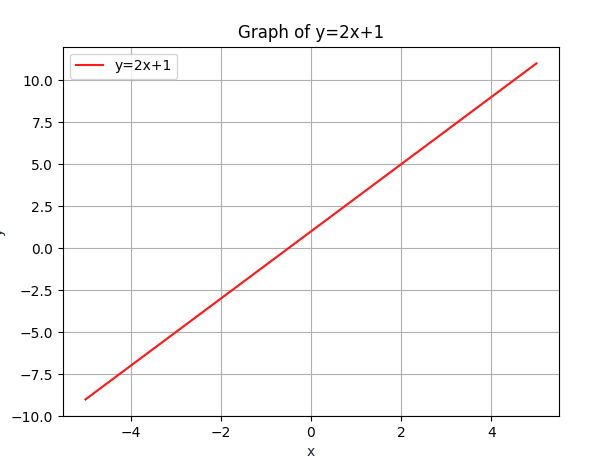
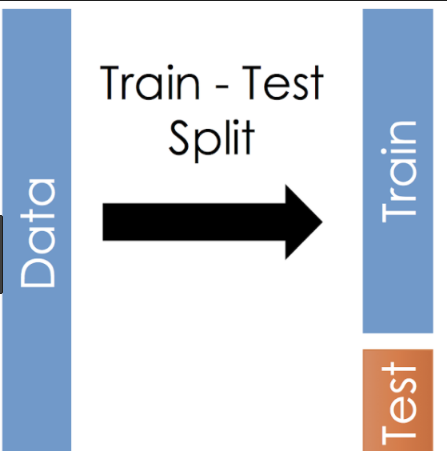
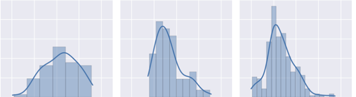
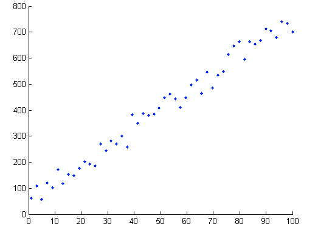

```{r setup, include=FALSE}
knitr::opts_chunk$set(echo = TRUE)
```

## Descripción general 

El proyecto consiste en aplicar los conocimientos aprendidos en clase (y
apoyándose de referencias adicionales útiles) para crear modelos
predictivos de regresión lineal uni-variable sencillos de la forma:

$y = f(x) = mx +b$

Donde:

y = la variable dependiente x = variable independiente m = pendiente de
la recta(parámetro del modelo) b = intercepto(parámetro del modelo)

Tanto "x" como "y" son parte del dataset usado , "m" y "b" son
parámetros del modelo los cuales buscamos estimar con los datos, esto
significa que se busca encontrar que valores de "m" y "b" producen una
recta que describa de la mejor manera posible la relación entre los
datos "x" y "y".

El siguiente ejemplo pertenece a una recta con parámetros m= 2, b = 1



Se trabajara con un set de datos de muchas variables y se realiza un
análisis exploratorio para visualizar y analizar los datos y entender
cómo se comportan y luego elegir las variables independientes "x" a
trabajar(según el potencial predictivo de estas a través de medir la
correlación) , esto significa que aunque el dataset posee múltiples
variables ,en vez de crear un modelo multi-variable crearemos múltiples
modelos uni-variable.

Los datos se encuentran dados en el formato binario de NumPy .npy por lo
tanto usaremos la función "load" de numpy para poderlos utilizar:
<https://docs.scipy.org/doc/numpy/reference/generated/numpy.load.html>

Usando slicing como fue visto en clase el dataset usado será dividido de
la siguiente forma:

-   80% del dataset(rows) se usará para todo el proceso(análisis
    exploratorio, selección de variables a usar, crear modelos
    predictivos). Les llamamos "datos de entrenamiento"

-   20% del dataset(rows) se usará para probar ,validar y evaluar los
    modelos resultantes. Esto significa que el 20% de data no es usado
    durante todo el proyecto y es usado solo al final del mismo cuando
    ya poseemos los modelos predictivos. Les llamamos "datos de
    validación y pruebas"

Para cada variable elegida "x" se crearán 2 modelos predictivos de
regresión lineal y el resultado o predicción final será el promedio
obtenido por los 2 modelos.

**Nota:** Para este proyecto y este curso , no nos preocupamos en la
definición de estos modelos y el proyecto consiste en convertir a código
de Python las expresiones matemáticas dadas que definen los modelos a
usar.

## **Descripción detallada**

Los datos del proyecto pertenecen al ejemplo clásico y muy común al
iniciar a estudiar ciencia de datos: predicción de precios de casas.

<https://drive.google.com/file/d/1Y5vA7xxk68rjhon6_SJCIqhDn2mIyBZU/view?usp=sharing>

Por lo tanto en el proyecto:

y = el precio de venta real de cierta casa\
x = cierta característica de cierta casa\
yhat = f(x) = precio estimado o predicción del precio de venta para una
casa con cierta característica x\
m = pendiente de la recta que usamos para aproximar el precio de la casa
yhat\
b = intercepto de la recta que usamos para aproximar el precio de la
casa yhat

m y b son conocidos como parámetros del modelo y son valores que
necesitamos encontrar usando los datos x,y

## Tareas a realizar:

-   Adicional a los paquetes vistos en clase instalar:

    -   scikit-learn ✅

    -   seaborn ✅

-   Usando sclicing con NumPy separar los datos en 2 datasets

    -   entrenamiento(80%)

    -   validación y pruebas(20%)



-   Análisis exploratorio de datos.

    -   Para cada variable en el dataset calcular (usando numpy o
        pandas): \#note df.describe(include='all') df.numeric.describe()
        para una columna

        -   media

        -   valor máximo

        -   valor mínimo

        -   rango(peak to peak, no el rango del tensor que por ser
            vector sabemos que es 1)

        -   desviación estándar

    -   Para cada variable en el dataset usar seaborn(función distplot
        <https://seaborn.pydata.org/generated/seaborn.distplot.html>)
        para graficar un histograma de la variable.



-   Para cada variable independiente x :

    -   Calcular el coeficiente de correlación entre x y y

    -   Graficar x vs y(scatterplot) usando matplotlib

    -   Colocar el coeficiente de correlación y colocarlo como parte del
        título de la gráfica.



-   Basado en la gráfica y el coeficiente de correlación de cada par x,y
    elegir las 2 variables con más potencial predictivo (las 2 que
    presentan mayor correlación).

-   Crear una función para entrenar un modelo de regresión lineal de una
    variable $y = mx +b$. La función recibe como argumentos:

    -   vector con la variable independiente "x" ,
    -   vector con la variable dependiente "y",
    -   un entero "epochs" que indica por cuantas iteraciones entrenar
        el modelo.
    -   un entero "imprimir_error_cada" , que nos indica cada cuantas
        iteraciones queremos imprimir a través de print : el número de
        iteración, el error del modelo en esa iteración, si
        imprimir_error_cada = 10, se despliega en pantalla el error en
        las iteraciones: 10,20,30,40,50
    -   escalar lr(learning rate): es usado como parte de la expresión
        matemática para actualizar en cada iteración los parámetros del
        modelo.

-   La función debe:

    -   Crear una matriz de 2 columnas ,la primera columna corresponde
        al vector de datos "x" y la segunda columna de la matriz para
        todas las filas es igual a

1.  Por ejemplo: Si el vector x originalmente contenía los valores:
    [1,3,5,6] debemos obtener:

|     |     |
|-----|-----|
| 1   | 1   |
| 3   | 1   |
| 5   | 1   |
| 6   | 1   |

-   Inicializar los parámetros del modelo en un vector (m,b), esto es
    equivalente a empezar el proceso con una recta inicial la cual en
    cada iteración actualizaremos hasta encontrar una que aproxime de
    buena manera los datos x,y

-   por cada epoch(iteración):

    -   Calcular yhat(predicción o estimación) para todas las
        observaciones de manera simultánea(vectorizada) utilizando el
        modelo correspondiente a la iteración(es decir , los valores de
        m,b): esto produce un vector yhat con el mismo número de
        elementos que y.

Conceptualmente el calcular vectorizadamente la predicción para una
única observación del datdataset, significaría aplicar el modelo lineal
a esta observación por ejemplo, si x = 2, y los parámetros son m = 0.1 ,
b = 0.2 tendríamos :

yhat = 0.1(2) + 0.2 Tomando en cuenta que agregamos una columna
adicional con el valor 1, podemos usar el producto punto para realizar
este mismo cálculo , por ejemplo(lo siguiente no es código real solo
ejemplo ): observacion = [2,1] parametros = [0.1,0.2] yhat =
np.dot(observacion,parametro) Esto es igual que : 2(0.1) + 1(0.2) =
2(0.1) + 0.2

Por lo tanto para calcular la aproximación yhat de manera simultánea a
todas las observaciones debemos aplicar una multiplicación
matricial(matriz ,vector)

■ Calcular el error o costo usando: y,y_hat

Esto produce un escalar que indica el error (mientras más alto peor el
modelo,mientras mas bajo mejor el modelo) producido por el modelo
correspondiente a la iteración(es decir, el error para ciertos
parámetros m,b) ■ Almacenar en un vector el error de cada iteración. ■
Calcular el gradiente del error respecto de cada parámetro con las
expresiones:

Nota: Este es conceptualmente el cálculo a realizar , traducido a
programación debemos hacerlo vectorizadamente ,es decir en vez de
realizar 2 cálculos independientes debemos realizar un solo cálculo cuyo
resultado es un vector, el primer elemento del vector es el gradiente de
m y el segundo vector el gradiente de b. Para hacer esto nos podemos
apoyar en el hecho de que el dataset tiene una columna con el valor de 1
para todos los elementos y la expresión para calcular el gradiente de b
se puede calcular a la forma equivalente:

■ Actualizar los parámetros del modelo con la expresión:

Donde : m y b: los parámetros del modelo gradientem, gradienteb: el
resultado del paso anterior learningRate: el parámetro o argumento "lr"
enviado a la función , un valor muy grande de este puede hacer que nunca
se logre la convergencia a un modelo adecuado y un valor muy pequeño
puede hacer que se necesiten demasiadas iteraciones(y mucho tiempo) para
obtener el modelo óptimo.\
Nota: Nuevamente esto es conceptualmente el cálculo a realizar, al
traducirlo a programación debemos hacerlo vectorizadamente utilizando el
vector de parámetros(con los valores de la iteración anterior) y el
vector gradiente calculado en el paso anterior. ■ Almacenar en una
estructura de datos el modelo resultante(a discreción del estudiante,
por ejemplo un diccionario donde la llave es el número de iteración y el
valor es un vector con los parámetros). ○ La función devuelve 2
resultados: ■ La estructura de datos conteniendo el modelo de cada
iteración. ■ El error de cada iteración

● Crear una función que nos permita visualizar con matplotlib cómo
cambia el error en el tiempo: crear una función que tome como parámetro
el vector de errores generados por la función de entrenamiento y
grafique en el eje "x" el número de iteración y en el eje "y" el error
para esa iteración:

En este proyecto solo debemos trabajar y graficar con el error obtenido
al entrenar por lo cual la gráfica resultante solo tendría una curva y
no 2 como en el ejemplo. ● Crear una función que nos permita visualizar
con matplotlib cómo evoluciona el modelo entrenado en el tiempo : Crear
una función que tome como parámetro la estructura de datos conteniendo
el historial de modelos ,y un valor "n" que indica cada cuantas
iteraciones graficar el modelo resultante, por ejemplo para n=3 la
función debe graficar la recta correspondiente al modelo junto a los
datos cada 3 iteraciones, si se ejecutaron 15 iteraciones , para n = 3
se grafica el modelo de las iteraciones 3,6,9,12,15 junto con los datos
de entrenamiento.

● Utilizar las funciones del punto anterior para entrenar modelos de
regresión lineal y=mx + b , para cada una de las variables "x" elegidas,
basándose en las funciones para graficar las curvas de aprendizaje y
comparación del modelo vs los datos elegir el número de "epochs" o
iteraciones a entrenar el modelo(y experimentar con el learning \_rate)
Criterio: El error debe disminuir lo más posible por lo cual la curva de
aprendizaje debe disminuir hasta que ya no disminuya mucho (se
estabilice o converja ) , si el error baja y comienza a subir debemos
usar menos iteraciones.

● Para cada una de las variables x seleccionadas, usar scikit-learn para
entrenar un modelo de regresión lineal:
<https://scikit-learn.org/stable/modules/generated/sklearn.linear_model.LinearRegression.html>
● Para cada variable independiente x elegida, crear una función que
usando el modelo entrenado manualmente y el modelo de
scikit-learn(enviados como parámetros a la funcion) calcule la
estimación o predicción de cada uno de estos y devuelva como resultado
una predicción estimada promediando las predicciones de los 2 modelos,
la función debe recibir como parámetro adicional un vector de cualquier
tamaño de x y devolver 3 vectores cada uno del mismo tamaño del vector
x. ○ La predicción con el modelo entrenado manualmente ○ La predicción
con el modelo de scikit-learn ○ La combinación(promedio) de las 2
anteriores. ● Usando el 20% de los datos de validación, aplicamos los
modelos predictivos para estimar la variable dependiente y usando los
valores reales de "y" calculamos el error de cada modelo. Para cada
variable independiente "x" elegida : ● Graficar el error de cada modelo
para esta variable "x" ● Concluir cuál modelo para la variable "x" es el
mejor a ser usado (error mas bajo)

En el siguiente ejemplo el color azul representa el error para el modelo
entrenado iterativamente , y el rosado el modelo de scikit learn y cada
elemento en el eje x es una de las variables independientes elegidas "x"

Restricciones ● El proyecto es individual. ● Se utilizará la herramienta
de verificación de similitud de código(plagio) para detectar copias y
código bajado de internet, en caso de encontrarse plagio se anulará el
proyecto. ● Es requisito entregar y aprobar el proyecto para aprobar el
curso. ● El proyecto se trabajará usando el formato usado para las
tareas prácticas: Jupyter notebook. ● No se permite usar librerías y
herramientas adicionales a las mencionadas en este enunciado: ○ Python ○
Numpy ○ Pandas ○ matplotlib ○ seaborn ○ scikit-learn ● Usar código
vectorizado y ufuncs siempre que sea posible. ● Usar git para llevar un
tracking del avance del proyecto y así mismo practicar el proceso de
versionamiento. El repositorio de github debe contener al menos 5
commits para el notebook del proyecto.
